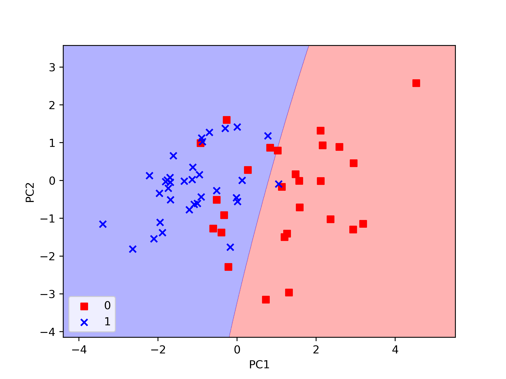
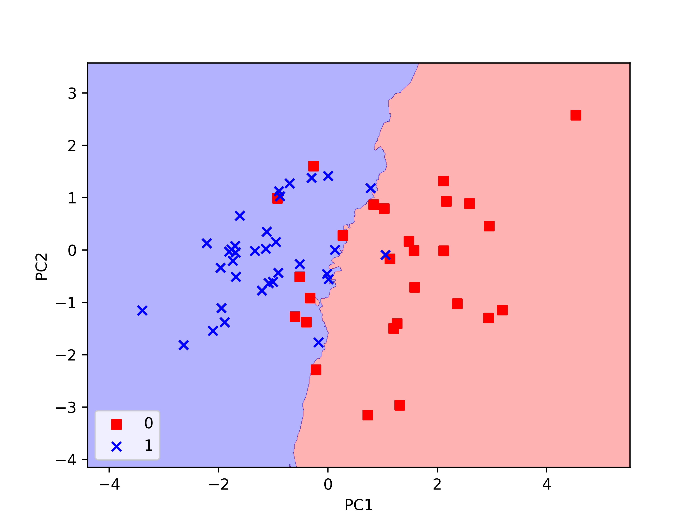
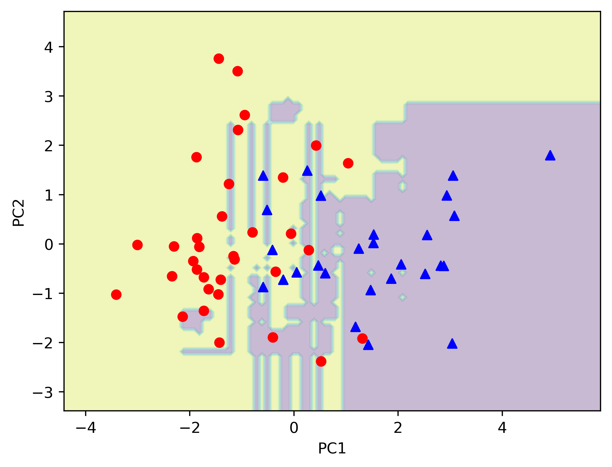

# Heart disease classification

This is an overview of different classification algorithms to diagnose heart diseases.
The [dataset](https://www.kaggle.com/ronitf/heart-disease-uci) contains 13 attributes along with a target condition of having (1) or not heart disease (0).

The 13 attributes are:
- **age**
- **sex**: 1=male, 0=female
- **cp**: The chest pain experienced (Value 1: typical angina, 
Value 2: atypical angina, Value 3: non-anginal pain, 
Value 4: asymptomatic)
- **trestbps**: The person's resting blood pressure (mm Hg on admission to the hospital)
- **chol**: The person's cholesterol measurement in mg/dl
- **fbs**: The person's fasting blood sugar (> 120 mg/dl, 1 = true; 0 = false)
- **restecg**: Resting electrocardiographic measurement (0 = normal, 1 = having ST-T wave abnormality, 2 = showing probable or definite left ventricular hypertrophy by Estes' criteria)
- **thalach**: The person's maximum heart rate achieved
- **exang**: Exercise induced angina (1 = yes; 0 = no)
- **oldpeak**: ST depression induced by exercise relative to rest ('ST' relates to positions on the ECG plot).
- **slope**: the slope of the peak exercise ST segment (Value 1: upsloping, Value 2: flat, Value 3: downsloping)
- **ca**: The number of major vessels (0-3)
- **thal**: A blood disorder called thalassemia (3 = normal; 6 = fixed defect; 7 = reversable defect)

## Data preprocessing

First, I use one-hot encoding to handle the categorical data such as **cp**, **restecg**, **slope**, **thal**, **sex**, **fbs** and **exang**.
Note that I dropped the first category of each to not have, for example, both **male** and **female** encoded.
The dataset is then split into training and test data sets (80%/20%).

## Models

I evaluated various classification algorithms using the scikit-learn tools.

### SVM

 1. Features standardization,
 2. dimensionality reduction via principal component analysis,
 3. classifier training.
 
I used k-fold cross-validation to assess the model performance.
The best hyperparameters according to the grid search algorithm are `C = 0.1`, `gamma = 0.01`
and `kernel = 'rbf'`.

```
Train set accuracy = 81.8%
Test set accuracy = 82%
```

In the following picture I show the decision boundaries for the test data set.



Where *PC1* and *PC2* denote the princial components after dimensionality reduction.

### KNN

1.,2. and 3. same as SVM model

With `n_neighbors = 50`,
```
Train set accuracy = 82.2%
Test set accuracy = 86.9%
```

Decision boundaries for the test set:



### ADABOOST

With
- `base_estimator = tree`, 
- `n_estimators=500`, 
- `learning_rate=0.1` 
I got `Test set accuracy = 85.2%`.



### RANDOM FOREST

```
Test accuracy = 82%
Sensitivity = 87.5%
Specificity = 76%
```

The following figure shows a visualization of one of the decision trees from the forest,


